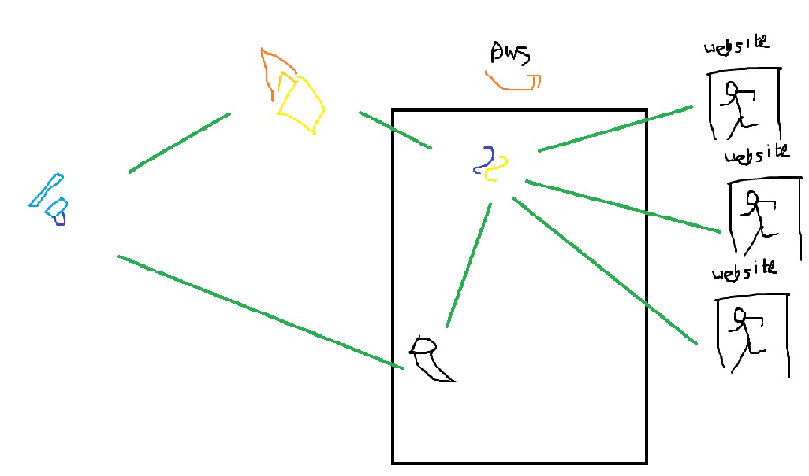

[](https://classroom.github.com/online_ide?assignment_repo_id=7010423&assignment_repo_type=AssignmentRepo)

**팀페이지 주소** -> https://kookmin-sw.github.io/capstone-2022-18

### 1. 프로잭트 소개
주어진 시간 안에 퍼즐을 해결하고 밀실을 탈출하는 방탈출 카페에 대한 정보를 제공하고, 원하는 테마의 예약을 돕는 모바일 어플리케이션을 제작하는 프로젝트입니다. 현재 각 카페에서 제공하는 정보들을 크롤링하여 한 화면에서 모아볼 수 있도록 하며, 관심있는 테마의 예약 정보를 제공합니다.

### 2. 소개 영상


### 3. 팀 소개
### **박정규** (----1624)
```
e-mail : pjg1020@kookmin.ac.kr
role : 어플리케이션 제작
```

### **김남재** (----1584)
```
e-mail : kimnj3050@kookmin.ac.kr
role : 데이터 수집, AWS 서버 관리
```

### 4. 사용법

소스코드제출시 설치법이나 사용법을 작성하세요.

### 5. 기타
구조도(이후 Update 예정)

