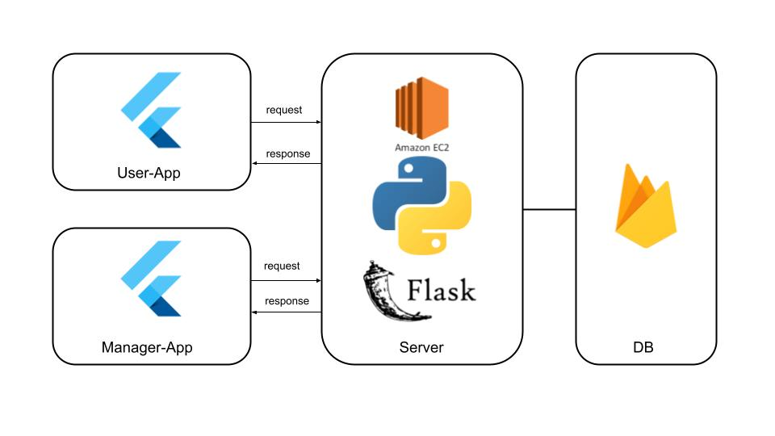

[](https://classroom.github.com/online_ide?assignment_repo_id=7010423&assignment_repo_type=AssignmentRepo)

**팀페이지 주소** -> https://kookmin-sw.github.io/capstone-2022-18

### 1. 프로잭트 소개
방탈출 게임이란 주어진 시간 안에 퍼즐을 해결하고 밀실을 탈출하는 놀이 문화의 하나로써, 최근 젊은 층을 중심으로 퍼져 나가고 있습니다. 이 프로젝트는 현재 대다수 방탈출 카페들이 가지는 문제점들(정보접근의 어려움, 폐쇄성으로 인한 게임 탐색의 어려움, 높은 예약난이도로 인한 어려움)을 파악하고 해당 어려움을 해소해주기 위한 모바일 어플리케이션을 개발하는 것을 목적으로 합니다.

방탈출모아 애플리케이션은 방탈출게임 정보 제공 앱입니다. 방탈출 모아 앱은 방탈출 카페와 테마에 대한 정보를 모아서 유저에게 제공하고, 예약을 돕기 위한 보조 수단으로써 예약 알림기능을 제공하며, 개별 맞춤 추천 시스템을 제공합니다.

### 2. 소개 영상
- [YouTube link](https://youtu.be/ABwturBCkWY)

### 3. 팀 소개
### **박정규** (----1624)
```
e-mail : pjg1020@kookmin.ac.kr
role : 어플리케이션 제작
```

### **김남재** (----1584)
```
e-mail : kimnj3050@kookmin.ac.kr
role : 데이터 수집, AWS 서버 관리
```

### 4. 사용법

소스코드제출시 설치법이나 사용법을 작성하세요.

### 5. 기타
구조도(이후 Update 예정)

